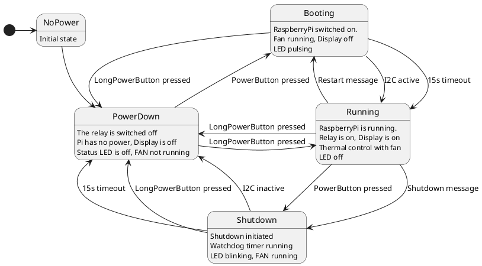

# piMac
A project to integrate a RaspberryPi into an old iMac G4

## Systemcontroller

The project integrates an Arduino Nano.  
It controls the following features of the piMac:

- Status LED
- Power Supply of pi & display 
- Display Dimming
- Power Button
- Temp Sensor
- Fan speed
- Opening and closing of front door 

Sourcecode can be found in /piMac_Systemcontroller

### Power statemachine

