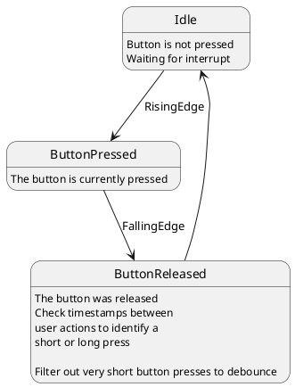

# Button driver

The simple button driver has these tasks:

- detect button press
- detect long button press
- debounce button press
- setup hardware

The button driver assumes a switch that connects GND to an interrupt capable GPIO of the ARDUINO.
The internal pull up resistor of the arduino will be used, so no external resistor is needed. 

## Dependencies

The function ```millis()```is used as timing source. 

## Usage

Interrupt driven approach, open points: 

- Is it possible to define a gpio 

 The gpio has to be set as parameter in the constructor. 
 Call ```????????``` frequently to operate the button driver. 
 It will return ?????? to 

#Button driver statemachine


