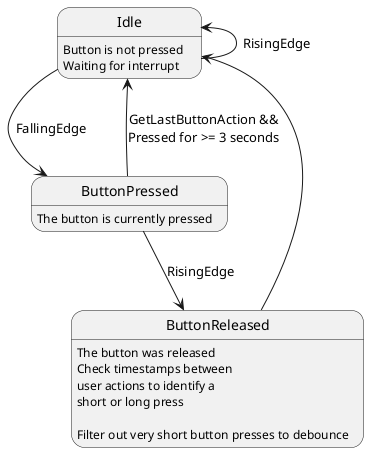

# Button driver

The simple button driver has these tasks:

- detect button press
- detect long button press
- debounce button press
- setup hardware

The button driver assumes a switch that connects GND to an interrupt capable GPIO of the ARDUINO when pressed.
The internal pull up resistor of the arduino will be used, so no external resistor is needed. 

## Dependencies

The function ```millis()```is used as timing source. 

Depends on ``interrupthandler.h`` as Interruptsource.

## Usage

The gpio has to be set as parameter in the constructor. 
The gpio must be interrupt capable, otherwise this driver can't be used. 

Call ``buttonaction GetLastButtonAction()`` to read the last button press. 
**NOTE:** The call will reset the last Button action -> a 2nd call will return ``None``

#Button driver statemachine


