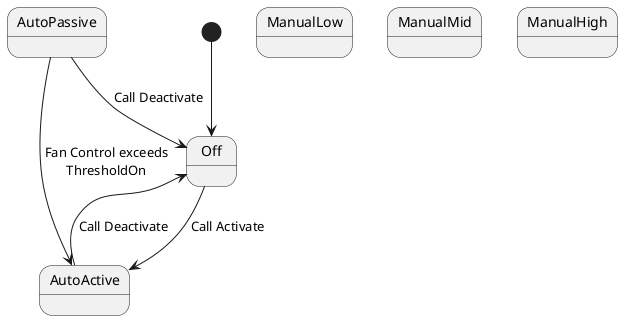

# Fan controller

The fan controller reads the temperature with the help of a thermistor and controls the chassis fan speed with a PWM output. 

A good functionality could be to switch the fan controller to a manual mode. (e.g. set to full speed)

## Control algorithm

The control algorithm should check every 5000ms for the current temperature.
After this an algorithm should control the speed of the fan according to that reading. 

First implementation:

### ProportionalControl

Note: The following assumptions are subject to be changed.

Calculation: 

FanSpeed = (Temperature - 35.0) * 5

| Temperature °C   | Fan Speed %   | Comment      |
| :---: | :----------: | :----------- |
| 25  | 0 | Below minimum temperatur to switch on |
| 35  | 0 | Minimum temperature to switch on the fan |
| 36  | 5 |  |
| 40  | 25 |  |
| ... | ... | 
| 55  | 100 | highest temperature we want to see
| 56  | 105 | Overdrive 
| ... | ... | 
| 86  | 255 | Maximum proportional controller output

Even when the fan is unable to spin faster than 100%, the controller should output an overdrive. 
If other controllers are involved, the proportional controller should have higher impact in *critical* situations. 

## PWM Control

PWM Control ranges from 0 to 255. The used transistor, fan and capacitor combination allows to drive the fan from 1 to 255 (some fans don't move when set too low)

This leads to a linear control possibility.

PWM Value = FanSpeed * 2.55

## Cooling states

