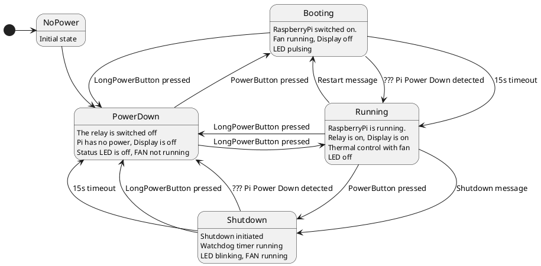

#Power statemachine

```plantuml
@startuml

state NoPower : Initial state
state PowerDown : The relay is switched off \nPi has no power, Display is off \nStatus LED is off, FAN not running
state Running : RaspberryPi is running.\nRelay is on, Display is on\nThermal control with fan\nLED off
state Shutdown : Shutdown initiated\nWatchdog timer running\nLED blinking, FAN running
state Booting : RaspberryPi switched on. \nFan running, Display off\nLED pulsing

[*] -> NoPower

NoPower --> PowerDown
PowerDown --> Booting : PowerButton pressed
Booting --> Running : ??? Pi Power Down detected 
Booting --> Running : 15s timeout
Running --> Shutdown : PowerButton pressed
Shutdown --> PowerDown : ??? Pi Power Down detected
Shutdown --> PowerDown : 15s timeout

'I2C messages
Running -left-> Booting : Restart message
Running -> Shutdown : Shutdown message

'Long press of the PowerButton
Running -> PowerDown : LongPowerButton pressed
Booting -> PowerDown : LongPowerButton pressed
Shutdown -> PowerDown : LongPowerButton pressed
PowerDown -> Running : LongPowerButton pressed

@enduml

```