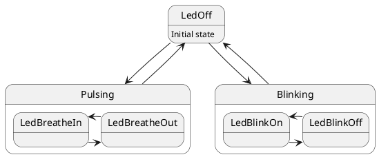

# Statusled 

The statusled class is a simple LED controller for Arduino. 

It currently supports blinking with 1/2 Hz rate and a "breathing" or "pulsing" light. 
Naming assumes a high active LED.

## Dependencies

The function ```millis()```is used as timing source. 

## Usage

 The gpio has to be set as parameter in the constructor. 
 Call ```void Operate()```frequently to operate the LED.
 Call ```void SwitchState(LEDstate)``` to change the LED State / picture. 

#Status LED Statemachine


