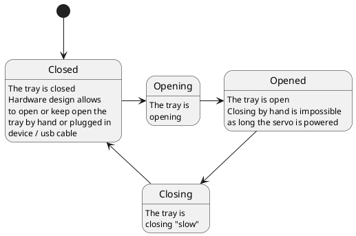

# Tray control

The "tray" of the iMac G4 is orignally opened by a DVD drive. 
As there is not enough space to fit all components and PCBs inside the case the DVD drive & HDD had to be removed.

Instead a USB3 hub was installed behind the tray door. 

To open the tray a small servo was installed to open and close the tray. 
The servo is powered by the same 12V to 5V supply that also powers the Arduino. 

PWM control gives the opportunity to open and close the tray. 
Setting a PWM value directly will drive the servo very fast, the tray would pop open and smash it closed.

The tray control class shall open and close the tray smoothly.

Maximum/Minimum PWM values for opened / closed tray are hardcoded and highly dependant on HW design. 

## Dependencies

``millis()``is used for timing. 

## Usage 

The c'tor needs a GPIO number as parameter
Call ``Operate`` frequently to operate all pending operations
Call ``Close`` to close the tray
Call ``Open`` to open they tray
Call ``Toggle`` to toggle between opened/closed

## Statemachine

